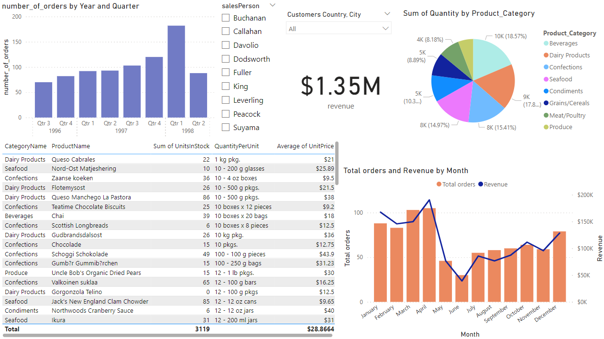

# Northwind Business Data Analysis

## Introduction:
Welcome to my portfolio project, where I dive deep into the ***Northwind database***, a comprehensive dataset representing a fictional trading company's operations. Through **SQL** queries and **powerBI** visual analysis, I aim to extract valuable insights that can inform strategic decision-making and drive business growth.   
This project involves analyzing the Northwind dataset, which is a sample database provided by Microsoft containing data about a fictitious company that imports and exports specialty foods. The project is divided into three main components:

1. Data Cleaning
2. Data Analysis
3. Data Visualization (using Power BI)

## Project Structure

The project is organized into the following files :

- **DataCleaning.md**: This file provides a detailed account of the data cleaning process, explaining how data issues were addressed and prepared for analysis. [File ](1_DataCleaning.md)

- **Data_Analysis.md**: This file contains the analysis of the cleaned data, presenting insights and findings. [File ](2_Data_Analysis.md)
- **PowerBI_Dashboard.pbix**: This Power BI file contains the interactive dashboard created for data visualization. [File ](3_PowerBI_Dashboard.pbix)

## Data Cleaning

The [`DataCleaning.md` ](1_DataCleaning.md) file outlines the steps taken to clean and preprocess the data. This includes:

- Handling missing values
- Correcting data types
- Normalizing data formats
- Removing duplicates
- Any other transformations necessary to prepare the data for analysis

## Data Analysis

The [`Data_Analysis.md` ](2_Data_Analysis.md) file presents the detailed analysis performed on the cleaned data. Key points of analysis include:

- Sales performance by product and region
- Customer demographics and purchasing behavior
- Supplier performance
- Inventory management

## Data Visualization

The [`PowerBI_Dashboard.pbix` ](3_PowerBI_Dashboard.pbix) file contains a Power BI dashboard that provides interactive visualizations of the analyzed data. Key features of the dashboard include:

---

